# GroundBlastFx

Volumetric ground effects for rocket engines in **Kerbal Space Program 1.12**: dust, launch pad steam, water spray,
vacuum ejecta, scorch marks and flame light, driven by the real thrust, height, surface, atmosphere and propellant of each
engine.

- Download: SpaceDock (link on the release page) — the archive contains `GameData/GroundBlastFx`.
- Requirements: KSP 1.12.x on **Windows / Direct3D 11**, a GPU with compute shaders. No other mod needed.
- License: MIT (`LICENSE`). Credits and code origin: `CREDITS.md`. History: `CHANGELOG.md`.

The player documentation is in [`GameData/GroundBlastFx/README.md`](GameData/GroundBlastFx/README.md).

## Screenshots

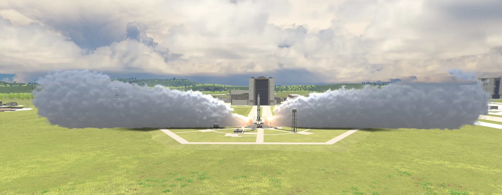
*Launch pad steam: two dense jets burst out of the real flame-trench outlets of the KSC pad and billow into long clouds lying on the ground.*

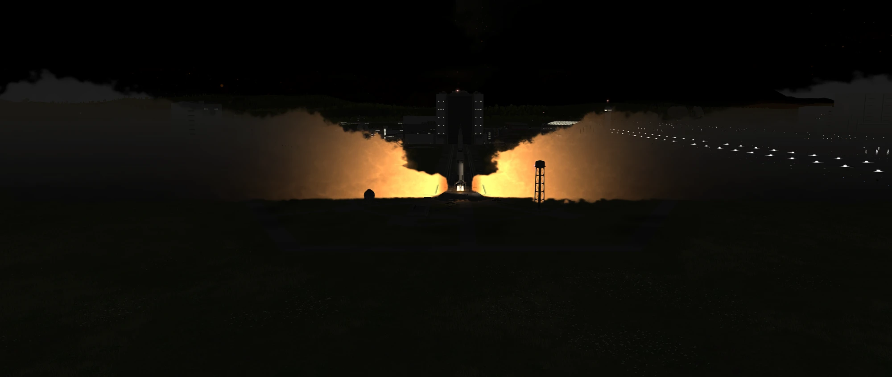
*Night launch: the engine flame lights the steam clouds from inside, orange at the core and fading into the dark.*

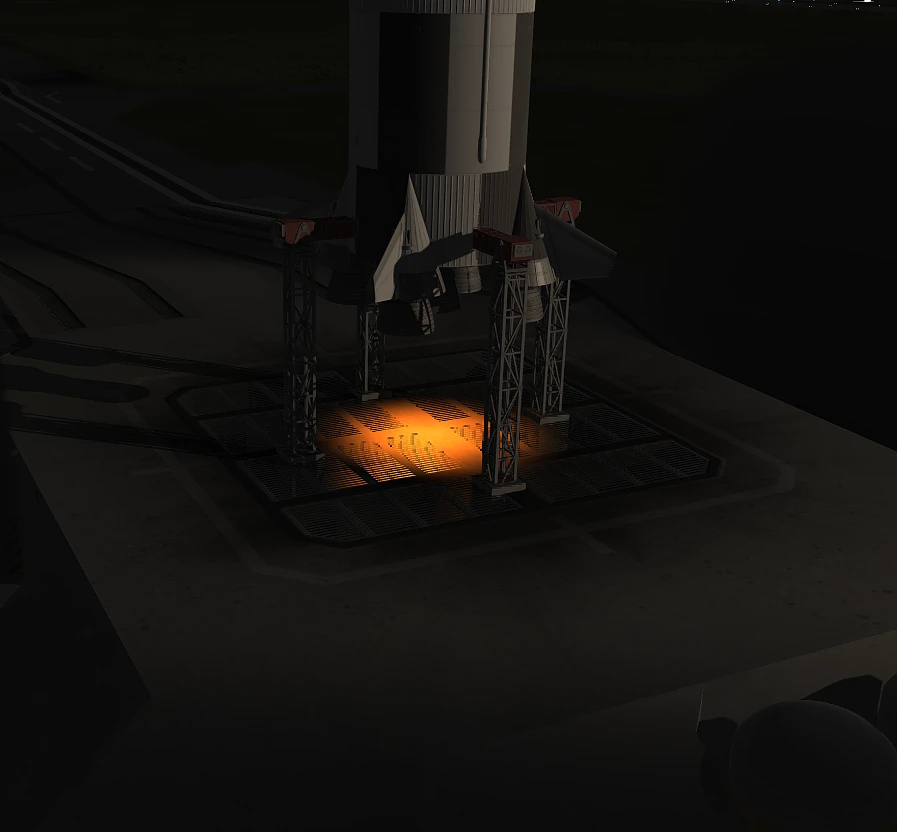
*Flame light: the engines light up the pad deck and the launch clamps around them.*

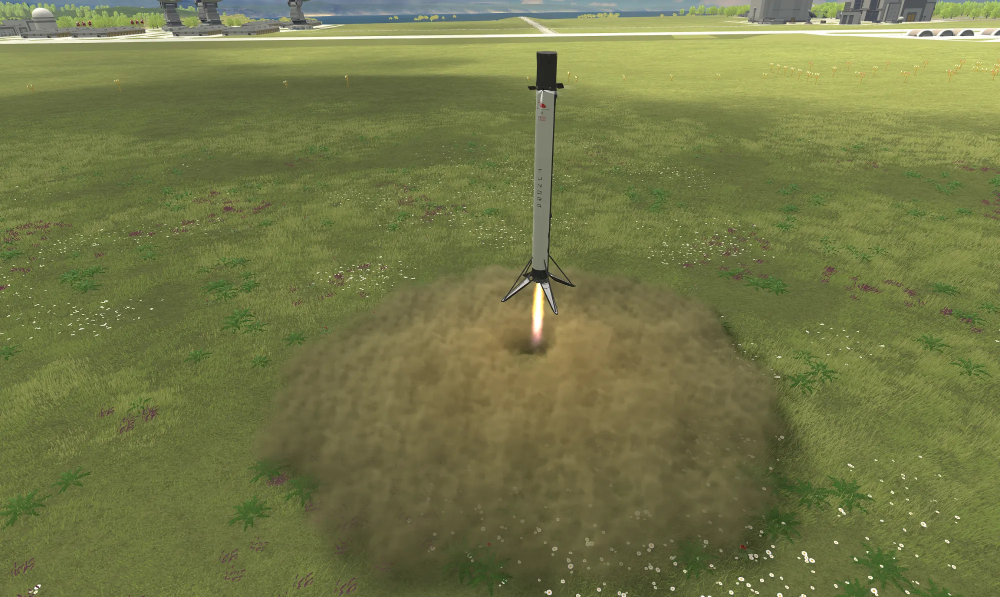
*Hovering over grass: the plume digs a clear spot under the nozzle and rolls a ring of dust outward, colored like the ground.*

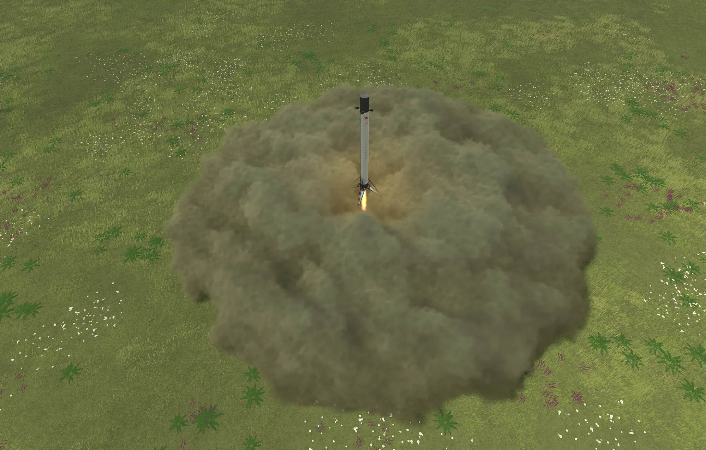
*Seen from above: a thick, billowing dust cloud built up by a hovering booster, lit by its own flame.*

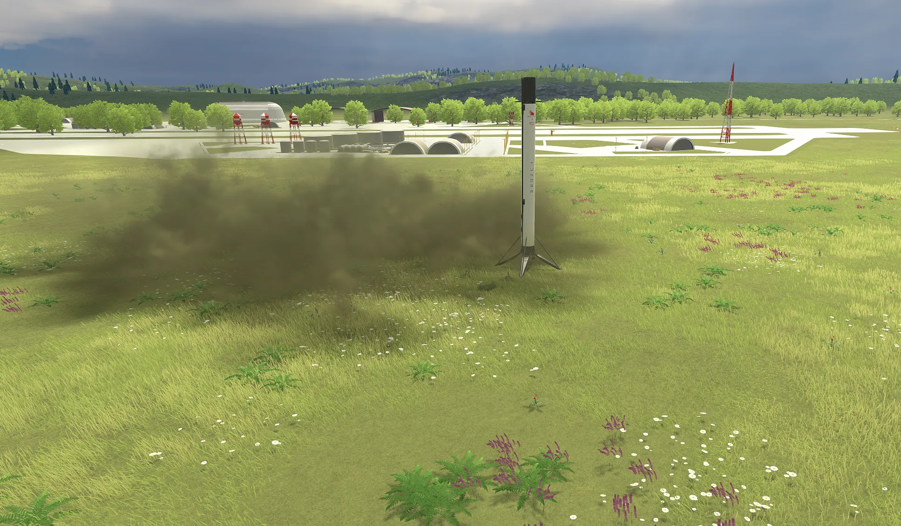
*Wind: after touchdown the dust cloud stays where it was made and slowly drifts away with the wind.*

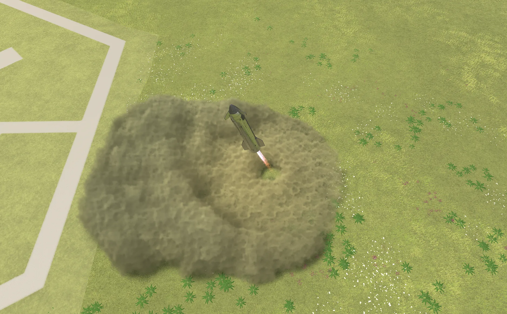
*Lift-off from the grass next to the pad: the cloud follows the real impact point of the plume.*

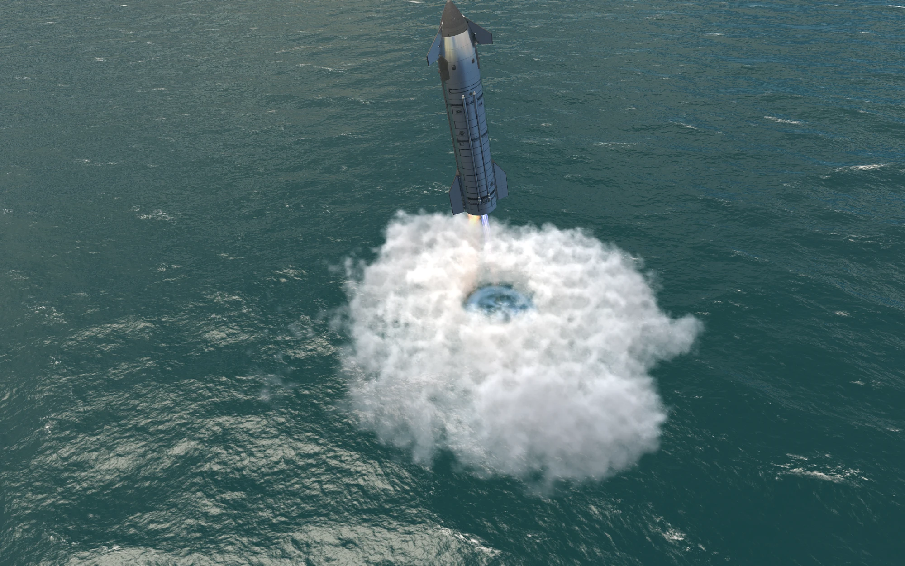
*Over water: the jet opens a crater in the surface and throws up a white ring of spray.*

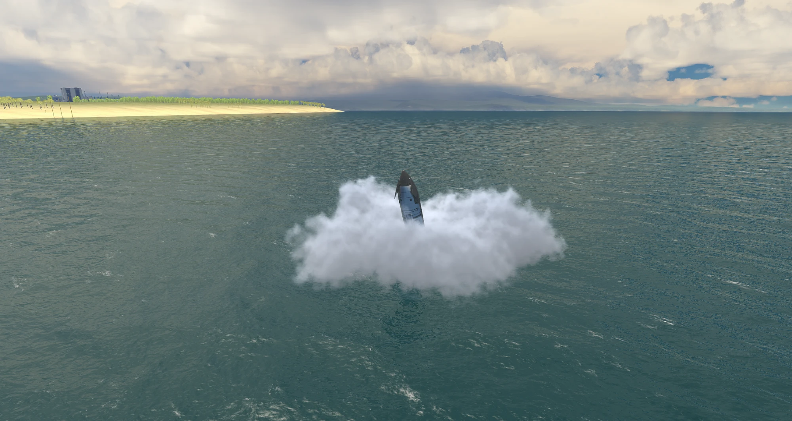
*Spray cloud over the sea, drifting with the wind near the KSC shore.*

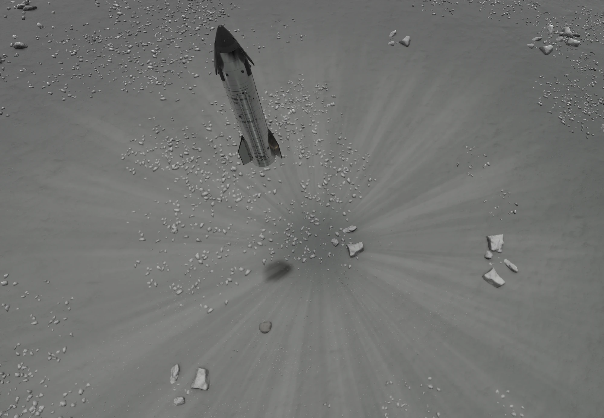
*On the Mun (no air): a thin streaked ejecta sheet races outward, no billowing cloud.*

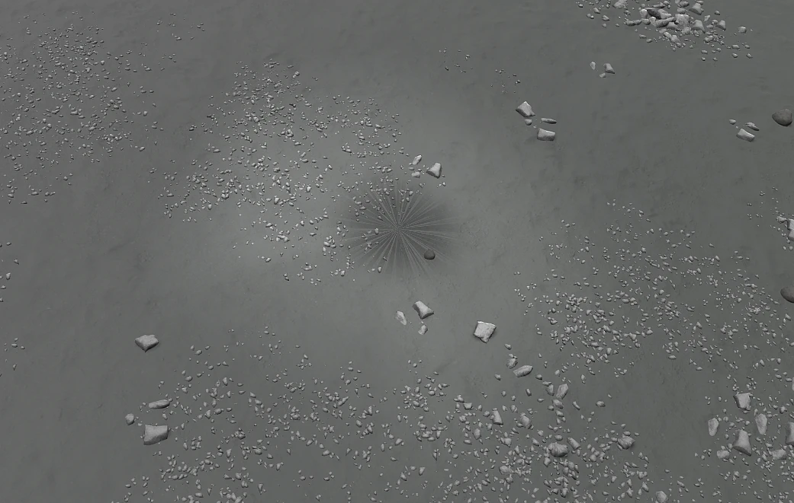
*The blast mark left on the Mun after landing, saved with your game.*

## How it works (short)

- The plugin samples every running engine (thrust, propellant, nozzle position), casts rays to find where the plume hits
  the ground, and groups nearby engines into "clusters".
- Each cluster owns a 3D density grid anchored to the ground and simulated on the GPU (`VolumeField.compute`):
  semi-Lagrangian advection, curl-noise turbulence, wall jet and flame-trench jets, buoyancy, wind, terrain height map.
- `GroundVolume.shader` ray-marches the grids at reduced resolution with Perlin-Worley detail, multiple-scattering
  lighting, flame light and cloud shadows, then composites over the game image before transparent objects.
- Airless bodies use a ballistic ejecta sheet and GPU particles instead of a cloud. Scorch marks are screen-space decals
  saved with the game (`ScenarioModule`).

## Repository layout

| Path | Content |
|---|---|
| `Source/GroundBlastFx` | C# plugin (net472, compiled against KSP's own assemblies) |
| `Tests/GroundBlastFx.Tests` | unit tests of the physical model (no KSP needed) |
| `UnityProject` | Unity 2019.4.18f1 project: shaders, compute shader, bundle builder, offline render harness |
| `GameData/GroundBlastFx` | mod folder: configs, texts (9 languages), prebuilt shader bundle |
| `Tools` | build, package and install scripts (PowerShell) |

## Building

1. Install the .NET SDK and have a KSP 1.12 install. Set `KSP_ROOT` to it (or pass `-KspRoot`).
2. Plugin and tests: `powershell -ExecutionPolicy Bypass -File Tools/build_dll.ps1 -Configuration Release -RunTests`
   (the DLL is copied to `GameData/GroundBlastFx/Plugins`).
3. Shaders (only if you change them): Unity **2019.4.18f1**, then `Tools/build_bundles.ps1`. A prebuilt
   `GroundBlastFx.unity3d` is included.
4. Release archive: `Tools/package.ps1` (writes `Release/GroundBlastFx-v<version>.zip`).

Offline renders without KSP: `Tools/render-tests/run.ps1` (Unity batch mode, same bundle and render code as the game).

Code comments are in French.
